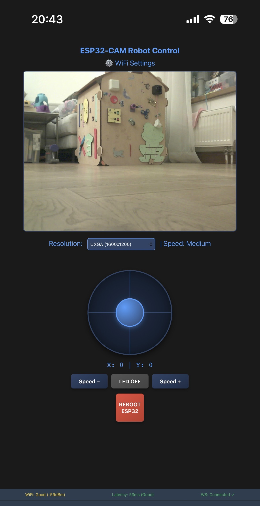

# Keyestudio ESP32-CAM 4WD Camera Monitoring Robot Car

An enhanced and improved firmware for the **Keyestudio ESP32-CAM 4WD Camera Monitoring Robot Car** educational robotic platform. This project extends the original Keyestudio design with advanced features including UDP video streaming, wireless joystick control, OTA updates, and dual communication protocols.




## 📋 Overview

This is an improved firmware version based on the original [Keyestudio ESP32-CAM 4WD Camera Robot Car](https://docs.keyestudio.com/projects/KS5024/en/latest/docs/4WD%20Camera%20Robot%20Car.html) project. It maintains compatibility with the original hardware while adding significant improvements to control, streaming, and robustness.

### Hardware

- **Microcontroller**: ESP32-CAM (AI-Thinker)
- **Camera**: OV2640 CMOS
- **Motors**: 4 DC motors (2WD system)
- **Power**: 7.4V LiPo battery (2S)
- **Connectivity**: WiFi 802.11 b/g/n
- **Additional**: RGB LED, motor drivers

## ✨ Key Features

### Camera & Streaming
- **MJPEG streaming** with configurable resolution
- **UDP video streaming** (Port 8889) - optimized for packet loss handling
- **Lower latency** compared to HTTP streaming
- **Smooth playback** with real-time performance (~20 FPS at QVGA)

### Control Methods
- **HTTP Web Interface** (Port 80) - Virtual analog joystick
- **UDP Control** (Port 8888) - Fast, low-latency command protocol
- **WebSocket Support** - Real-time bidirectional communication (async version)
- **Python GUI Joystick** - Keyboard and joystick-based control

### Advanced Features
- **Over-The-Air Updates (OTA)** - Update firmware wirelessly
- **Motor Watchdog** - Safety feature to stop motors if commands timeout
- **WiFi Status Display** - Monitor connection quality
- **Access Point Mode** - Configure WiFi without pre-programmed credentials
- **Captive Portal** - Easy device setup interface
- **ArduinoOTA Support** - Standard OTA update mechanism

### Code Versions
Choose the firmware version that best fits your needs:

1. **HTTP Server Version** (Current Default)
   - Stable ESP-IDF native HTTP server
   - Separate control and streaming ports
   - Lower memory overhead
   - Best for reliable HTTP streaming

2. **AsyncWebServer + WebSocket Version**
   - Non-blocking async architecture
   - Real-time WebSocket communication
   - UDP video streaming option
   - Better resource efficiency

See [VERSIONS_COMPARISON.md](VERSIONS_COMPARISON.md) for detailed comparison.

## 🚀 Getting Started

### Prerequisites
- PlatformIO (recommended) or Arduino IDE
- Python 3.x (for control scripts)
- WiFi network (or use Access Point mode)

### Installation

1. **Flash Firmware**
   ```bash
   platformio run --target upload
   ```
   See [firmware_release/FLASH_INSTRUCTIONS.md](firmware_release/FLASH_INSTRUCTIONS.md) for detailed flashing instructions.

2. **Install Python Dependencies**
   ```bash
   pip install opencv-python numpy
   ```

3. **Connect to Robot**
   - Robot creates WiFi network `ESP32-CAM-Setup` (or connects to existing network)
   - Default Passw0rd: `12345678` (change in code before deployment!)

### Quick Control Examples

**Easy Way (Recommended for Beginners):**
```bash
# You can use the mDNS hostname directly (no need to find IP!)
python udp_video_viewer.py esp32-cam-4wd.local
python test_udp_control.py esp32-cam-4wd.local
```

**Or use your robot's IP address:**
```bash
# Replace 192.168.X.X with your actual robot IP
python udp_video_viewer.py 192.168.X.X
python test_udp_control.py 192.168.X.X
```

#### UDP Video Streaming
```bash
python udp_video_viewer.py esp32-cam-4wd.local
```

#### UDP Joystick Control
```bash
python test_udp_joystick.py esp32-cam-4wd.local
```

#### Keyboard Control
```bash
python test_udp_control.py esp32-cam-4wd.local
```

See [JOYSTICK_GUIDE.md](JOYSTICK_GUIDE.md) for detailed control instructions.

## 🎮 Control Keys

| Input | Action |
|-------|--------|
| **W** / **↑** | Forward |
| **S** / **↓** | Backward |
| **A** / **←** | Turn Left |
| **D** / **→** | Turn Right |
| **Q** | Forward-Left Arc |
| **E** | Forward-Right Arc |
| **X** | Stop Motors |
| **R** | Toggle LED |
| **1** | Decrease Speed |
| **2** | Increase Speed |
| **ESC** | Quit Application |

## 📡 Network Configuration

### Ports
- **Port 80** - HTTP Control interface & web page
- **Port 81** - HTTP Streaming (streaming version)
- **Port 8888** - UDP Control commands
- **Port 8889** - UDP Video streaming

### WiFi Modes
- **Station Mode** - Connect to existing WiFi network
- **AP Mode** - Create own WiFi network for setup
- **Both** - Check [SECURITY_CHANGES.md](SECURITY_CHANGES.md) for details

### Easy Device Access (mDNS)
Once connected to WiFi, access your robot using the **mDNS hostname**:
```
http://esp32-cam-4wd.local
```

No need to find the IP address! Just use this link in any browser on the same network.

### Configuration

WiFi credentials are stored in device preferences. To reconfigure:
1. Access web interface at `http://esp32-cam-4wd.local/`
2. Go to setup page
3. Enter new WiFi credentials

## 📦 Project Structure

```
├── src/
│   ├── robotuko_kodas.cpp           # Main firmware (HTTP server version)
│   ├── robotuko_kodas.cpp.async_version   # AsyncWebServer version
│   └── robotuko_kodas.cpp.backup    # Backup of original version
├── include/                          # Header files
├── lib/                              # Libraries
├── python/
│   ├── udp_video_viewer.py           # UDP video streaming viewer
│   ├── test_udp_control.py           # Keyboard control
│   ├── test_udp_joystick.py          # Joystick control
│   └── udp_joystick_gui.py           # GUI joystick interface
├── firmware_release/                 # Precompiled releases
├── platformio.ini                    # PlatformIO configuration
├── partitions_ota.csv                # Partition table for OTA
└── test/                             # Test files
```

## 🔧 Configuration

### Security
- **Default Password**: `12345678` - **Change this before deployment!**
- Modify `DEVICE_PASSWORD` in firmware source code
- See [SECURITY_CHANGES.md](SECURITY_CHANGES.md) for detailed security recommendations

### Motor Speed
- Default speed: 170 (range 0-255)
- Adjustable via `motorSpeed` variable in code
- Can be modified at runtime via web interface

### Camera Settings
- **Resolution**: Configurable from QVGA to XGA
- **Frame Rate**: ~20 FPS at QVGA resolution
- **LED Control**: Toggleable via webUI or remote commands

## 📚 Documentation

- [JOYSTICK_GUIDE.md](JOYSTICK_GUIDE.md) - Detailed control instructions
- [UDP_VIDEO_README.md](UDP_VIDEO_README.md) - UDP streaming setup
- [VERSIONS_COMPARISON.md](VERSIONS_COMPARISON.md) - Firmware versions comparison
- [SECURITY_CHANGES.md](SECURITY_CHANGES.md) - Security recommendations
- [OTA_INSTRUCTIONS.md](OTA_INSTRUCTIONS.md) - Over-The-Air update guide
- [firmware_release/](firmware_release/) - Precompiled binaries and flash instructions

## 🔄 OTA Updates

Update firmware wirelessly without physical USB connection:

```bash
# Via Arduino IDE Setup
1. Tools → Port → Select network port
2. Upload as usual

# Via PlatformIO
platformio run --target upload
```

See [OTA_INSTRUCTIONS.md](OTA_INSTRUCTIONS.md) for detailed instructions.

## 🛠️ Development

### Building Firmware

**PlatformIO** (Recommended):
```bash
platformio run --target upload
```

**Arduino IDE**:
1. Install ESP32 board support
2. Select: `Tools → Board → AI Thinker ESP32-CAM`
3. Set upload speed to 115200
4. Press Upload

### Debug Output
Enable debug output by setting:
```cpp
#define DEBUG_ENABLED 1
```

## ⚠️ Troubleshooting

### Robot Won't Connect to WiFi
- Check WiFi credentials in web interface
- Reset to default: Enter AP mode `ESP32-CAM-Setup`
- Check router WiFi band (use 2.4 GHz, not 5 GHz)

### Poor Video Quality / Latency
- Move closer to WiFi router
- Reduce video resolution
- Use UDP streaming for better packet loss handling
- Check for RF interference

### Motors Not Responding
- Check motor connections
- Verify motor pins in code match your hardware
- Check battery voltage (should be 7.4V+)
- Look at debug output for watchdog timeouts

For more troubleshooting, see specific documentation files.

## 📝 License

This is an enhanced version of the Keyestudio ESP32-CAM 4WD Robot project. 
Original project: [Keyestudio ESP32-CAM 4WD Camera Robot Car](https://docs.keyestudio.com/projects/KS5024/en/latest/docs/4WD%20Camera%20Robot%20Car.html)

## 🤝 Contributing

Contributions are welcome! Please feel free to submit issues and enhancement requests.

## 📧 Support

For issues with the original hardware specifications, consult the [Keyestudio documentation](https://docs.keyestudio.com/projects/KS5024/en/latest/docs/4WD%20Camera%20Robot%20Car.html).

---

**Happy Building! 🤖**
